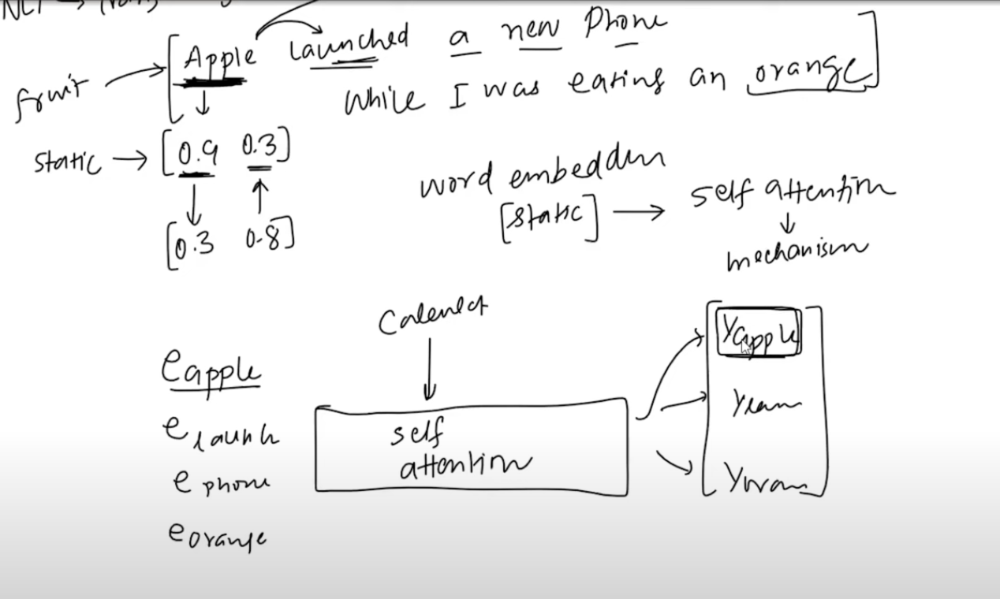
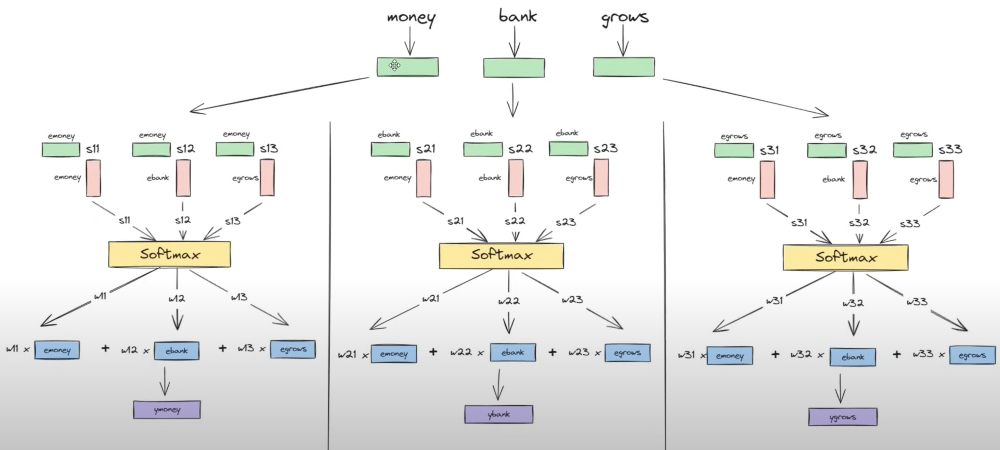
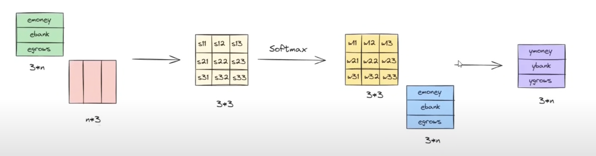
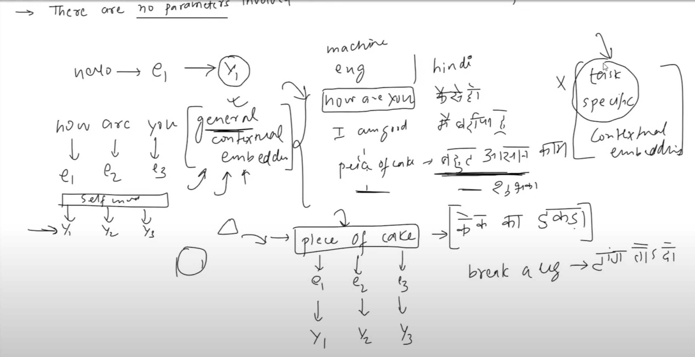
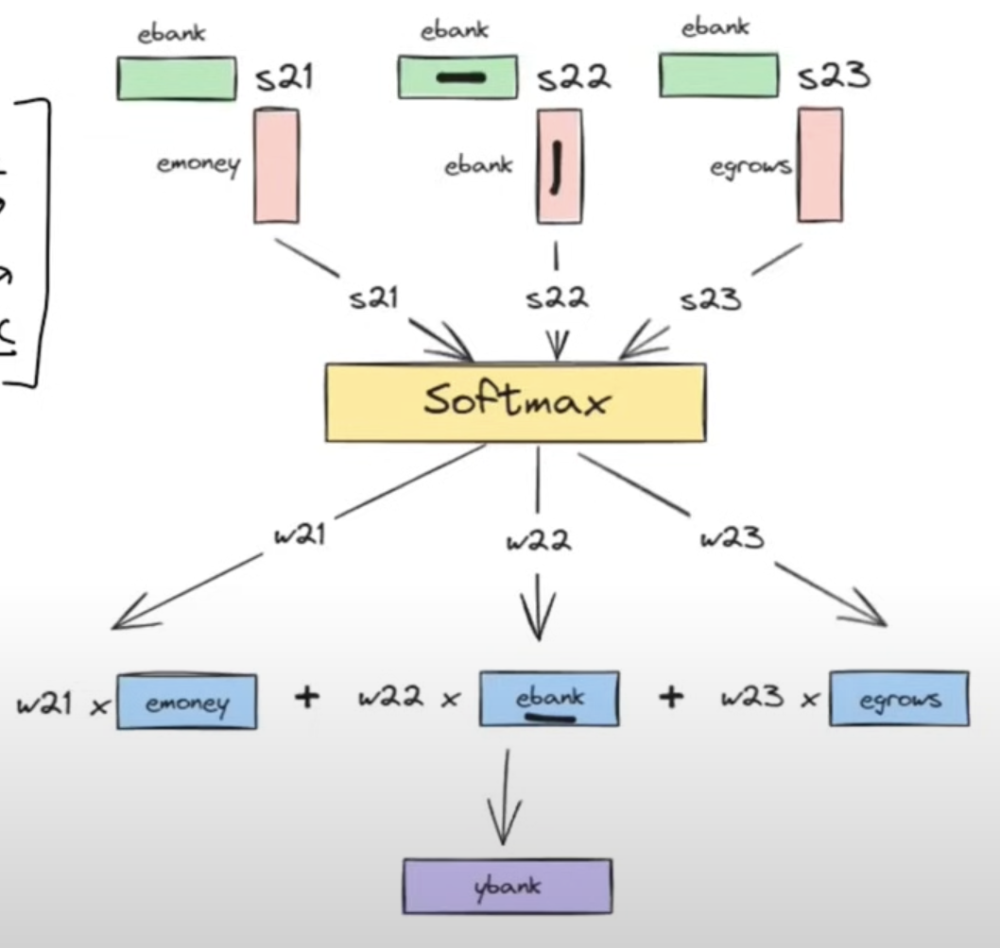
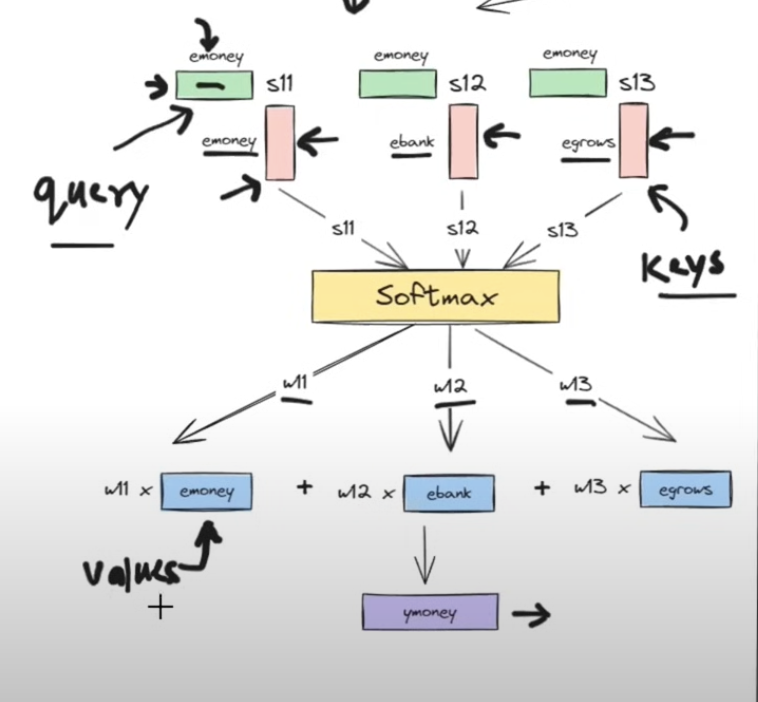
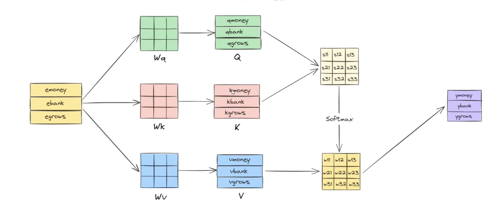

# Concept of Self-Attention 🧘🏻

## Introduction

- Most important part in any nlp product is the embedding of the words.
- But, the embedding of a word we use remains same throughout the sentence (**irrespective of context**).
- This poses a problem.
- For example,
```
sentence 1: An Apple a day keeps the doctor away.
sentence 2: Apple just launched a new iPhone.

=================================

- In normal embedding, the word "Apple" will have same embedding in both the sentences.

- But, in reality, the word "Apple" in sentence 1 is a fruit and in sentence 2 is a company.
```

- This is where **self-attention** comes into picture.

---

## What is Self-Attention?



- We pass in `normal embeddings` of words into **self-attention** and it gives us `contextual embeddings` of words.

- it helps to `capture dependencies` and `relationships within input sequences`.

- It allows the model to identify and weigh the importance of different parts of the input sequence by attending to itself.

---

## So, let's modify embeddings based on context  (`Contextual Embeddings`) 🤔

- We saw the issue with normal embeddings.
> **So, why don't we modify the embeddings based on the context of the sentence?**
>
> We will multiply the embeddings with some weights based on the context of the sentence.
>
> For example, Let's say we have a sentence "Apple is a fruit." and "Apple launched a new phone".
> - In first sentence, $$ e_{apple} = 0.7 * e_{apple} + 0.05 * e_{is} + 0.15 e_{a} + 0.1 * e_{fruit} $$
> 
> Now, the embedding of "Apple" will be more inclined towards fruit. (since, context is now taken into consideration)
> 
> ---
>
> **But, where does these weights come from?** 🤔
> 
> For now, let's just assume we calculate them based on their similarity with the words in the sentence.
>
> So, basically we are doing **`dot product`** of the embeddings of the words and then normalizing them (**softmax**) to get the weights.
>
> ```
> dot_product = []
> for word in sentence:
>     dot_product.append( dot( word, sentence ) )
>
> weights = softmax( dot_product )
> ```
> - We're doing **softmax** to make sure the weights sum to 1.



- What we get at the end is **contextual embeddings** of the words.

### Pros & Cons of this approach:

- `Pro`: All the contextual embeddings are calculated in parallel. So, it's very fast.
  - Matrix multiplication can be done on GPUs and the contextual embeddings can be calculated very fast.



- `Con`: There're no **learnable parameters**. So, it's not learning anything. It's just calculating the weights based on similarity.
  - It will only calculate **general contextual embedding**. It won't be able to learn anything specific to the task. (like, `piece of cake`, it will think of cake and not the idiom.)



- `Con`: It's **not capturing the sequence information**.

---

## Let's introduce Learnable Parameters 🧠



- One issue we can clearly see is, same embedding of a word is used in all the sentences. (irrespective of context)
- So, we can introduce some learnable parameters to modify the embeddings based on the context.



---

## Query, Key, Value

- We will introduce 3 learnable parameters for each word.
    - `Query`
    - `Key`
    - `Value`

- 3 different neural networks will be used to calculate these parameters for each word based on the context.

---

## Overall idea:



- We have original embeddings of the words.
- We pass them through 3 different neural networks to get `Query`, `Key` and `Value` for each word.
- Then, we will calculate similarity between `Query` and `Key` for each word.
- Then, we will normalize the similarities using **softmax** to get the weights.
- Then, we will multiply the weights with `Value` to get the `contextual embeddings` of the words.

<br/>

- **All these steps are done in parallel. So, it's very fast.**