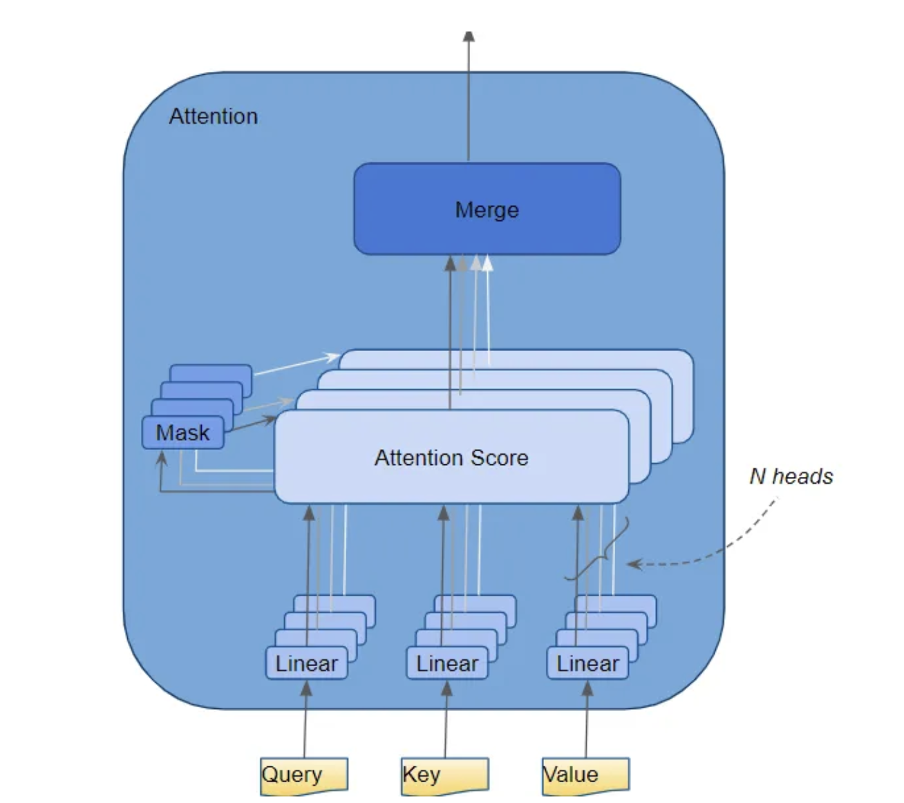

# Multiple Attention Heads 🧘🏻🧘🏻‍♀️

- In the Transformer, the Attention module repeats its computations multiple times in parallel. 
- Each of these is called an `Attention Head`. 
- The **Attention module splits its Query, Key, and Value parameters N-ways and passes each split independently through a separate Head**. 
- *`All of these similar Attention calculations are then combined together to produce a final Attention score`*. 
- This is called **`Multi-head attention`** and gives the Transformer greater power to encode multiple relationships and nuances for each word.

---

### The Multi-head attention mechanism is defined as follows:

> - Split the Query, Key, and Value parameters N-ways.
> - Pass each split independently through a separate Attention Head.
> - Concatenate the outputs of each Head.
> - Apply a linear transformation to produce the final Attention score.

---

### Analogy:

- The Multi-head attention mechanism is like having multiple teachers in a classroom, each of whom is an expert in a different subject.

- Each teacher can focus on a different aspect of the input, and their combined knowledge can provide a more comprehensive understanding of the material.