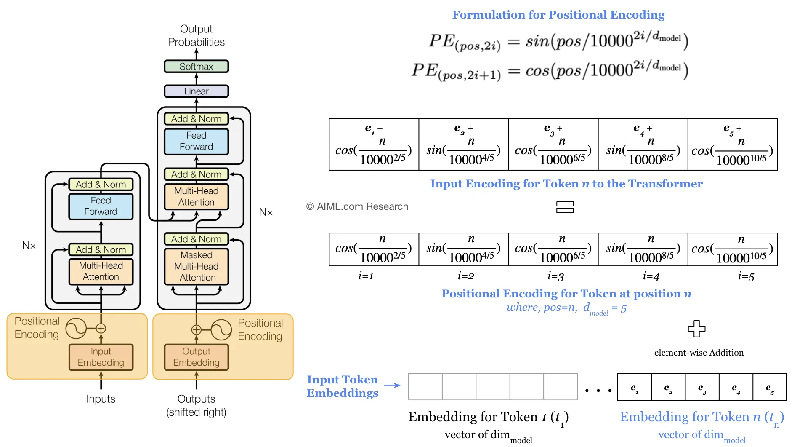
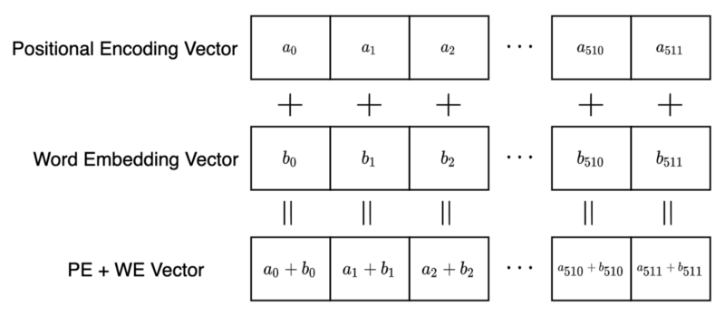
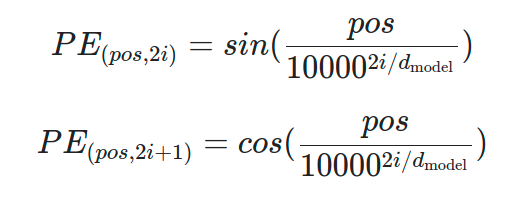
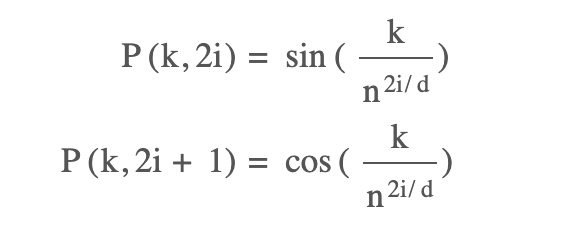

# Positional Encoding



- **Positional encoding is the scheme through which the knowledge of the order of objects in a sequence is maintained.**

> In languages, the order of the words and their position in a sentence really matters. 
> 
> The meaning of the entire sentence can change if the words are re-ordered. 
> 
> When implementing NLP solutions, **recurrent neural networks have an inbuilt mechanism that deals with the order of sequences**. 
> 
> The **transformer model, however, does not use recurrence or convolution and treats each data point as independent of the other**. 
> 
> ---
> 
> ***Hence, positional information is added to the model explicitly to retain the information regarding the order of words in a sentence***. 

---

## Positional Encoding in Transformer



- We already have our token/word embeddings.
- We **add positional encodings to these embeddings to retain the order of the words in the sentence**.

---

## But, how do we calculate positional encodings?



Where,

- `pos` is the position of the word in the sentence.
- `i` is the index of the dimension of the positional encoding.
- `d_model` is the dimension of the word embeddings.

### For odd indices:

- Use `sin` function.

### For even indices:

- Use `cos` function.

---

## But, why `sin` and `cos` functions? 🤔

- The outputs of `sin` and `cos` functions are **bounded**. So, they **don't explode or vanish.**

- Periodicity: They have repetitive patterns, which is useful for attention mechanism in a trackable manner.

- **Easy to extrapolate for long sequences and easy to compute**. Even if we have not computed it for a specific index, we can easily compute it using the formula.

---

## Details:



- In **Attention is All You Need** paper, the authors have used `n=10000`.


---

## Python code using `numpy`:

```python
import numpy as np
import matplotlib.pyplot as plt
 
def getPositionEncoding(seq_len, d, n=10000):
    P = np.zeros((seq_len, d))
    for k in range(seq_len):
        for i in np.arange(int(d/2)):
            denominator = np.power(n, 2*i/d)
            P[k, 2*i] = np.sin(k/denominator)
            P[k, 2*i+1] = np.cos(k/denominator)
    return P
 
P = getPositionEncoding(seq_len=4, d=4, n=100)
print(P)
```

---

## Summary:

- We add positional encodings to the word embeddings to retain the order of the words in the sentence.