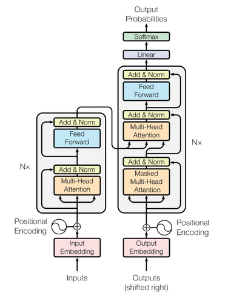

# Add & Norm

- After `Multi-head attention` and `Feed forward network`, the output of each sub-layer is passed through a `residual connection` and then `Layer Normalization` is applied.

- The `residual connection` is used to avoid the vanishing gradient problem.

- **Add** in `Add & Norm` refers to the `residual connection` and **Norm** refers to the `Layer Normalization`.